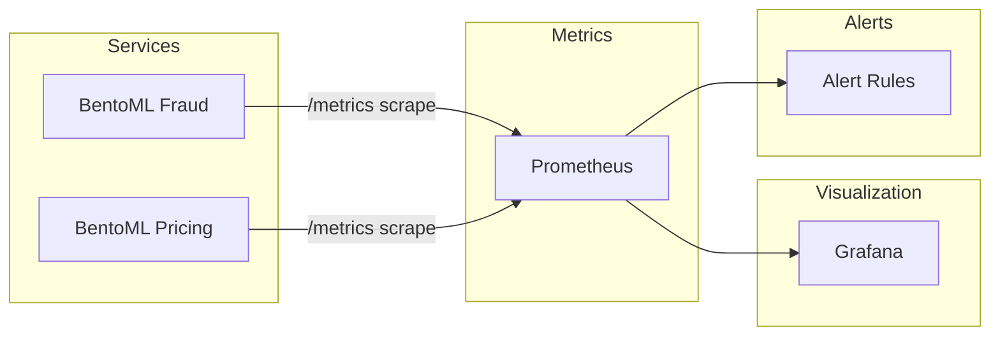

# Observability

*Last updated: February 2026.*

Describes the observability stack as configured in this repo: Prometheus, Grafana, alert rules, metrics, and health checks, and how to observe drift, retraining, fraud detection performance, flash sales, and system degradation.

---

## 1. Observability Stack Overview



- **BentoML** services expose a `/metrics` endpoint (Prometheus format). Prometheus scrapes them every 15 seconds.
- **Drift metrics** (`ml_data_drift_score`, `ml_drift_detected`) are produced by the monitoring utilities; they can be set via `set_prometheus_gauges()` in a process that Prometheus scrapes, or pushed via Pushgateway if you add one.
- **Grafana** uses Prometheus as a data source and ships with a provisioned **MLOps Overview** dashboard.
- **Alert rules** are evaluated by Prometheus; when conditions hold for the configured `for` duration, alerts fire (view under **Alerts** or **Status → Rules** in the Prometheus UI).

---

## 2. Prometheus

**Configuration:** `services/monitoring/prometheus/prometheus.yml`

- **Scrape interval:** 15s (global).
- **Rule file:** `/etc/prometheus/alert_rules.yml` (loaded inside the container).

**Scrape targets:**

| Job              | Target                    | Path   |
|------------------|---------------------------|--------|
| prometheus       | prometheus:9090           | -      |
| bentoml-fraud    | bentoml-fraud:7001        | /metrics |
| bentoml-pricing  | bentoml-pricing:7002      | /metrics |
| mlflow           | mlflow:5000               | /metrics |
| airflow-webserver| airflow-webserver:8080    | /metrics |

**Access:** http://localhost:9090

### Metrics reference

| Metric | Type | Labels | Description |
|--------|------|--------|-------------|
| **bentoml_requests_total** | Counter | service, endpoint, http_status | Total requests handled by BentoML services. |
| **bentoml_request_latency_seconds** | Histogram | service, endpoint | Request latency in seconds (used for p50/p95/p99). |
| **bentoml_request_errors_total** | Counter | service, endpoint | Total errors raised by BentoML services. |
| **ml_data_drift_score** | Gauge | - | Data drift score in [0, 1]. Set by monitoring utilities. |
| **ml_drift_detected** | Gauge | - | 1 if drift detected (e.g. score ≥ 0.3), else 0. |
| **feast_feature_freshness_seconds** | Gauge | - | Placeholder: feature store data freshness (not yet implemented). |
| **feast_feature_query_duration_seconds** | Gauge/Histogram | - | Placeholder: feature query latency (not yet implemented). |
| **airflow_dag_success_rate** | Gauge | - | Placeholder: DAG success rate (not yet implemented). |
| **ml_pricing_revenue_impact** | Gauge | - | Placeholder: business metric (not yet implemented). |
| **ml_fraud_savings** | Gauge | - | Placeholder: business metric (not yet implemented). |

### Example PromQL queries

- **Request rate (RPS) by service:**  
  `sum(rate(bentoml_requests_total[5m])) by (service)`
- **Error rate by service:**  
  `sum(rate(bentoml_request_errors_total[5m])) by (service) / sum(rate(bentoml_requests_total[5m])) by (service)`
- **p99 latency by service:**  
  `histogram_quantile(0.99, sum(rate(bentoml_request_latency_seconds_bucket[5m])) by (le, service))`
- **Current drift score:**  
  `ml_data_drift_score`
- **Whether drift is detected:**  
  `ml_drift_detected`

---

## 3. Alert Rules

**File:** `services/monitoring/prometheus/alert_rules.yml`  
**Group:** `mlops_alerts` (evaluated every 30s).

| Alert | Condition | For | Severity | Description |
|-------|-----------|-----|----------|-------------|
| **ModelLatencyHigh** | p99 latency > 0.2 s (200 ms) | 5m | warning | Model serving p99 above 200 ms. |
| **ErrorRateHigh** | (errors / requests) > 0.01 (1%) | 5m | warning | Model serving error rate above 1%. |
| **FeatureFreshnessStale** | feast_feature_freshness_seconds > 300 | 2m | warning | Feature store data older than 5 minutes. |
| **DataDriftDetected** | ml_data_drift_score > 0.3 | 2m | warning | Data drift above threshold; consider retraining. |

**Viewing alerts:** In Prometheus UI go to **Alerts** (or **Status → Rules**) to see firing/pending alerts and labels.

---

## 4. Grafana Dashboards

**MLOps Overview** dashboard is provisioned from `services/monitoring/grafana/dashboards/` (UID: `mlops-overview`).

**Panels:**

1. **Model serving latency (p50, p95, p99) by service** — Time series of latency quantiles from `bentoml_request_latency_seconds_bucket`.
2. **Request rate by service** — `sum(rate(bentoml_requests_total[5m])) by (service)`.
3. **Error rate by service** — Errors / requests by service.
4. **Feature store query performance** — Placeholder for `feast_feature_query_duration_seconds`.
5. **Airflow DAG success rate** — Placeholder for `airflow_dag_success_rate`.
6. **Data drift score over time** — `ml_data_drift_score` (0–1).
7. **Pricing revenue impact** — Placeholder for `ml_pricing_revenue_impact`.
8. **Fraud savings** — Placeholder for `ml_fraud_savings`.

**Access:** http://localhost:3000 (default: admin / admin).  
**Dashboard:** Dashboards → **MLOps Overview**.  
**Refresh:** 30s; default time range: last 1 hour.

**Editing:** Dashboards are stored under `services/monitoring/grafana/dashboards/`. Change the JSON and restart Grafana (or use the UI and re-export).

---

## 5. How to Observe: Model Drift and Retraining

Use this flow to see when drift is detected and when a retraining would be triggered.

1. **Generate drift-like behavior (optional)**  
   Run the simulator `drift` scenario to simulate changing behavior:  
   `python -m simulator.cli run drift --drift-level 0.7 -o reports/drift.html`

2. **Run the monitoring pipeline**  
   In Airflow (http://localhost:8080), unpause and trigger the **ml_monitoring_pipeline** DAG. It will:
   - Collect production-like metrics (synthetic in Phase 5).
   - Compute a drift score and write `data/monitoring/daily_drift_summary.json` (drift_score, mean_prediction, mean_label).
   - Compare drift_score to threshold 0.30 and set `needs_retrain`.
   - Log whether it would send alerts and trigger retraining.

3. **Inspect the drift summary**  
   Open `data/monitoring/daily_drift_summary.json` and check `drift_score` and (in production) any related fields.

4. **Query Prometheus**  
   If drift metrics are exposed (e.g. via a sidecar or Pushgateway that calls `set_prometheus_gauges()`), run:
   - `ml_data_drift_score`
   - `ml_drift_detected`

5. **View in Grafana**  
   On the MLOps Overview dashboard, use the **Data drift score over time** panel. If the score stays above 0.3, you are in “drift detected” state.

6. **See the alert**  
   In Prometheus → **Alerts**, **DataDriftDetected** will be firing when `ml_data_drift_score > 0.3` for 2 minutes.

7. **See the retraining trigger**  
   In Airflow, open the **ml_monitoring_pipeline** run and the **trigger_retraining** task logs. When `needs_retrain` is true, the log will state that it would trigger the **model_training_pipeline** DAG (in production this would be a TriggerDagRunOperator).

---

## 6. How to Observe: Fraud Detection Performance

- **Request volume and errors:** In Grafana, use **Request rate by service** and **Error rate by service** filtered to the fraud service (`service="fraud_detection"` or equivalent). In Prometheus:  
  `sum(rate(bentoml_requests_total[5m])) by (service)` and the error-rate expression from section 2.

- **Latency:** Use **Model serving latency (p50, p95, p99)** for the fraud service. If p99 exceeds 200 ms for 5 minutes, **ModelLatencyHigh** will fire.

- **Stress test:** Run the simulator `fraud-attack` scenario while watching the same panels:  
  `python -m simulator.cli run fraud-attack -o reports/fraud-attack.html`  
  Observe latency and error rate; confirm **ModelLatencyHigh** and **ErrorRateHigh** if SLAs are violated.

---

## 7. How to Observe: Flash Sale / High Load

- **Traffic and latency:** Run the `flash-sale` or `black-friday` simulator scenario. In Grafana, watch **Request rate by service** and **Model serving latency (p50, p95, p99)**.

- **Errors:** Watch **Error rate by service**. If error rate stays above 1% for 5 minutes, **ErrorRateHigh** will fire in Prometheus.

- **Prometheus:** Use the same PromQL queries as in section 2 over the time range of the run.

---

## 8. How to Observe: System Degradation

- **Scenario:** Run `system-degradation`:  
  `python -m simulator.cli run system-degradation -o reports/system-degradation.html`  
  This simulates partial failures (e.g. slow Redis, model timeouts).

- **What to watch:**  
  - Error rate and latency in Grafana (and corresponding Prometheus queries).  
  - **ErrorRateHigh** and **ModelLatencyHigh** alerts if degradation is severe enough.

- **Pricing service:** The dynamic pricing service has a rule-based fallback (`rule_based_fallback`). Under degradation, check logs and behavior for fallback usage (e.g. timeouts or feature unavailability leading to fallback).

---

## 9. Health Checks

| Component | Endpoint or method | Notes |
|-----------|--------------------|--------|
| **BentoML Fraud** | `POST http://localhost:7001/healthz` | Returns JSON e.g. `{"ok": true, "detail": "model_loaded"}`. |
| **BentoML Pricing** | `POST http://localhost:7002/healthz` | Returns JSON e.g. `{"ok": true, "detail": "bandit_ready"}`. |
| **MLflow** | `GET http://localhost:5001/healthz` | Probes MLflow at 5000; returns 200 when MLflow responds. Optional Basic Auth via HEALTH_BASIC_AUTH_*. |
| **Feast** | `feature_store_healthcheck(repo_path)` in Python | Returns repo_path, feature_view_count, feature_view_names. No HTTP endpoint by default. |
| **PostgreSQL** | `pg_isready -U <user> -d postgres` | Used by Docker healthcheck for postgres. |
| **Redis** | `redis-cli ping` | Used by Docker healthcheck for redis. |
| **MinIO** | `GET http://localhost:9000/minio/health/ready` | Used by Docker healthcheck for minio. |

Example (PowerShell):

```powershell
curl -X POST http://localhost:7001/healthz
curl -X POST http://localhost:7002/healthz
curl http://localhost:5001/healthz
```

---

## 10. Using Monitoring Utilities Programmatically

From a notebook or script (with the project installed, e.g. `pip install -e .`):

**Generate drift report and check thresholds:**

```python
import pandas as pd
from common.monitoring_utils import (
    generate_drift_report,
    extract_prometheus_metrics,
    check_alert_thresholds,
    set_prometheus_gauges,
    save_report_html,
)

ref = pd.DataFrame({"x": [1.0, 2.0, 3.0], "y": [10.0, 20.0, 30.0]})
cur = pd.DataFrame({"x": [1.1, 2.2, 2.9], "y": [12.0, 18.0, 35.0]})

result = generate_drift_report(ref, cur, include_html=True)
print("Drift score:", result.drift_score, "Detected:", result.drift_detected)

metrics = extract_prometheus_metrics(result)
# Push metrics to Pushgateway or expose in a scrape target:
# set_prometheus_gauges(result)

if check_alert_thresholds(result, drift_threshold=0.3):
    print("Alert: drift above threshold; retraining recommended.")

save_report_html(result, "data/monitoring/drift_report.html")
```

**Performance comparison (when Evidently is available):**

```python
from common.monitoring_utils import compare_model_performance

# Reference and current DataFrames with prediction and target columns
perf = compare_model_performance(ref_df, cur_df, target_column="label", prediction_column="pred")
print(perf.accuracy_current, perf.accuracy_reference)
```

**Threshold with performance degradation:**

```python
# Trigger if drift >= 0.3 OR accuracy drops by more than 10% vs reference
trigger = check_alert_thresholds(
    result,
    drift_threshold=0.3,
    performance_threshold=0.10,
    performance_current=0.82,
    performance_reference=0.91,
)
```

For more on architecture and algorithms, see **how_it_works.md**. For run instructions and simulator usage, see **how_to_run.md**.
