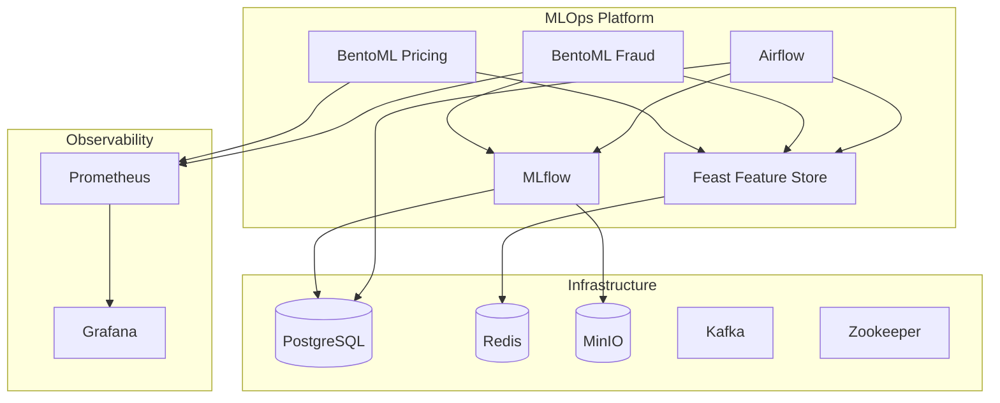
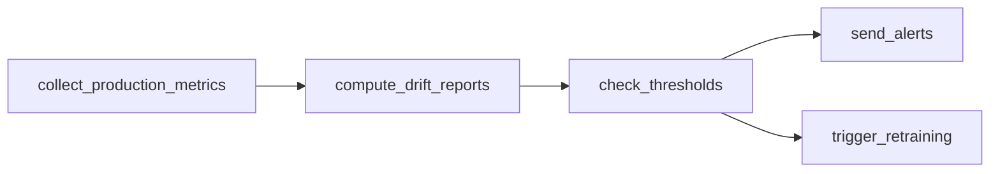
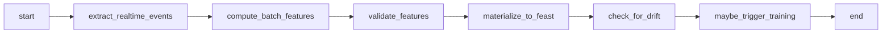
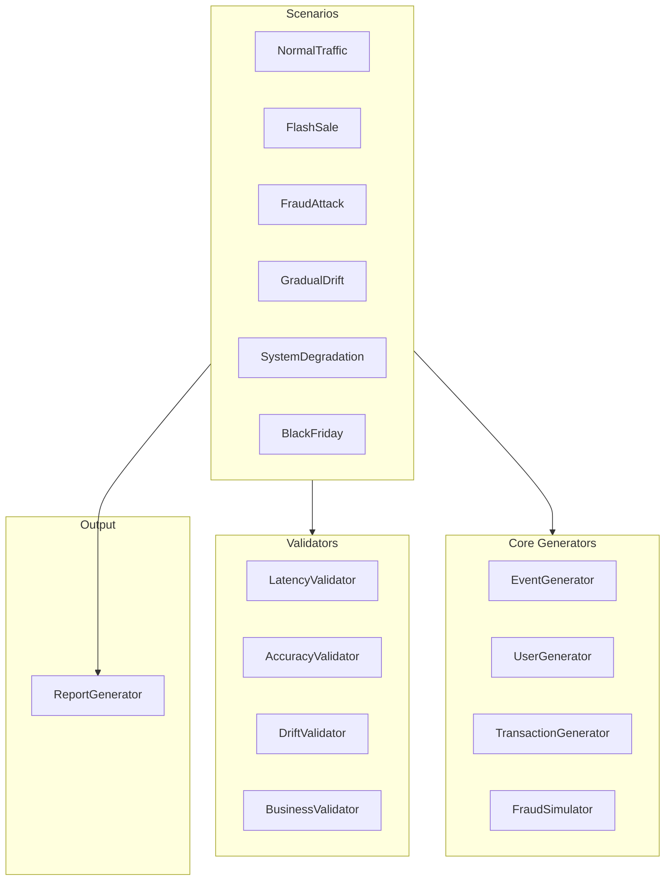

# How It Works

This document describes each component of the Ibook MLOps platform: architecture, data flows, algorithms (in pseudo-code style), and configuration.

---

## 1. System Architecture Overview

The platform runs as a set of services orchestrated by Docker Compose (local) or Kubernetes (production). Data flows from events and users through the feature store into model training and serving, with monitoring and drift detection closing the loop.



**Data flow (simplified):**

1. **Training:** Airflow (or notebook) builds a training dataset from Feast (or synthetic data) → trains XGBoost with Optuna → logs model and metrics to MLflow.
2. **Serving:** BentoML fraud/pricing services load the model from MLflow and features from Feast → respond to prediction/recommend requests.
3. **Monitoring:** Prometheus scrapes BentoML (and optionally MLflow/Airflow) → Grafana visualizes; Airflow runs a daily monitoring DAG that computes drift and can trigger retraining.

---

## 2. Infrastructure Layer

| Component | Role |
|-----------|------|
| **PostgreSQL** | Shared by Airflow (DAG metadata, task state) and MLflow (experiments, runs, model registry). Databases: `airflow`, `mlflow`. |
| **Redis** | Feast online store: low-latency feature lookup for real-time prediction. |
| **MinIO** | S3-compatible object storage; MLflow stores model artifacts and SHAP outputs here. |
| **Kafka + Zookeeper** | Event streaming. Used by the feature engineering DAG in production; locally the pipeline uses stubs. |

---

## 3. Feature Store (Feast)

**Location:** `services/feast/feature_repo/`

**Structure:**

- `feature_store.yaml` — store config (offline: DuckDB local / BigQuery prod; online: Redis).
- `data_sources.py` — data source definitions (e.g. Parquet file sources for local).
- `features.py` — entities and feature views.

**Entities:** `event` (event_id), `user` (user_id), `promoter` (promoter_id).

**Feature views:**

- **event_realtime_metrics** — current_inventory, sell_through_rate_5min, concurrent_viewers (TTL 60 min).
- **event_historical_metrics** — total_tickets_sold, avg_ticket_price, promoter_success_rate (TTL 365 days).
- **user_purchase_behavior** — lifetime_purchases, fraud_risk_score, preferred_category (TTL 365 days).

**Online vs offline:** Online = Redis (low-latency serving). Offline = DuckDB (local) or BigQuery (production) for historical training datasets.

**Feature retrieval (pseudo-code):**

```
FUNCTION fetch_online_features(features[], entity_rows[], store, use_cache):
    fs = store OR get_feature_store(repo_path)
    IF use_cache AND cache.has(fs, features, entity_rows):
        RETURN cache.get(fs, features, entity_rows)
    response = fs.get_online_features(features=features, entity_rows=entity_rows)
    df = response.to_df()
    IF use_cache:
        cache.put(fs, features, entity_rows, df)
    RETURN df
```

Training datasets use **historical retrieval** with an entity DataFrame that includes `event_timestamp` for point-in-time correctness: `fs.get_historical_features(entity_df=entity_df, features=feature_refs)`.

---

## 4. Model Training Pipeline

**Algorithm:** XGBoost binary classifier for fraud detection (objective: `binary:logistic`).

**Implementation:** `common/model_utils.py` — `build_fraud_training_dataframe()` and `train_fraud_model()`.

**Training data:** Features: `lifetime_purchases`, `fraud_risk_score`. Label: `is_fraud_label` = 1 if `fraud_risk_score >= fraud_threshold` (default 0.05), else 0.

**Pseudo-code: training loop**

```
FUNCTION train_fraud_model(df, target_column, n_trials=5, test_size=0.2):
    feature_names = resolve_feature_columns(df, target_column)
    X, y = df[feature_names], df[target_column]
    X_train, X_valid, y_train, y_valid = train_test_split(X, y, test_size, stratify=y)

    study = create_study(direction="maximize")
    FOR trial IN 1..n_trials:
        params = {
            max_depth: suggest_int(2, 4),
            learning_rate: suggest_float_log(0.05, 0.3),
            n_estimators: suggest_int(20, 60),
            subsample: suggest_float(0.6, 1.0),
            colsample_bytree: suggest_float(0.6, 1.0)
        }
        model = XGBClassifier(**params, objective="binary:logistic")
        model.fit(X_train, y_train)
        y_pred_proba = model.predict_proba(X_valid)[:, 1]
        auc = roc_auc_score(y_valid, y_pred_proba)
        log_params_and_metrics_to_mlflow(params, auc, accuracy)
        RETURN auc  // Optuna maximizes AUC

    best_params = study.best_params
    best_model = XGBClassifier(**best_params).fit(X_train, y_train)
    SHAP: explainer = TreeExplainer(best_model); log shap values + sample to MLflow artifacts
    mlflow.xgboost.log_model(best_model, artifact_path="model")
    RETURN TrainingResult(model, feature_names, best_params, roc_auc, accuracy, run_id)
```

**MLflow:** Logs parameters, ROC-AUC and accuracy, model artifact, and SHAP artifacts under experiment `fraud_detection`.

**Airflow DAG:** `model_training_pipeline` runs on a weekly schedule (`@weekly`). Tasks: build training dataset → train_model → evaluate_against_baseline → register_and_mark_candidate → deploy_canary (stub) → monitor_canary (stub) → finalize_promotion (stub).

---

## 5. Model Serving (BentoML)

### 5.1 Fraud Detection Service (port 7001)

**Flow:** HTTP batch request → build entity rows (user_id, event_id) → fetch Feast online features (e.g. user_purchase_behavior: lifetime_purchases, fraud_risk_score) → run XGBoost inference → return fraud_score and is_fraud (threshold 0.5).

**Pseudo-code:**

```
ON POST /predict WITH FraudBatchRequest:
    FOR each request IN batch.requests:
        entity_rows.append({user_id, event_id})
    features_df = get_fraud_features_for_entities(entity_rows)  // Feast + optional overrides
    predictions = model.predict_batch(features_df)  // XGBoost predict_proba; threshold 0.5
    RETURN FraudBatchResponse(predictions)
```

**Model loading:** Resolves latest model from MLflow registry (by stage or version), then loads the XGBoost artifact.

### 5.2 Dynamic Pricing Service (port 7002)

**Algorithm:** Thompson Sampling multi-armed bandit with Beta(α, β) per arm. Arms in code: `baseline`, `aggressive` (and optionally fallback for circuit breaker).

**Pseudo-code: Thompson Sampling**

```
STATE: arms = { "baseline": (α, β), "aggressive": (α, β) }  // Beta priors

FUNCTION choose_arm():
    FOR each arm, (α, β) IN arms:
        sample[arm] = random_beta(α, β)
    RETURN argmax(sample)

FUNCTION update(arm, reward):   // reward in [0, 1]
    α, β = arms[arm]
    α += clip(reward, 0, 1)
    β += 1 - clip(reward, 0, 1)
    arms[arm] = (α, β)
```

**Pricing logic (pseudo-code):**

```
FUNCTION recommend_price(request, features_row):
    arm = bandit.choose_arm()
    base_price = request.current_price
    IF arm == "aggressive": uplift = 0.10 ELSE uplift = 0.0
    velocity = features_row["event_realtime_metrics__sell_through_rate_5min"] OR 1.0
    inventory = features_row["event_realtime_metrics__current_inventory"] OR 1.0
    demand_factor = clip(velocity / max(inventory, 1), 0.5, 2.0)
    recommended = base_price * (1 + uplift) * demand_factor
    RETURN (recommended, arm, lower_ci, upper_ci)
```

**Fallback:** `rule_based_fallback(current_price)` returns `current_price * 1.05` when the bandit or features are unavailable (circuit breaker).

---

## 6. Drift Detection and Retraining

**Implementation:** `common/monitoring_utils.py` — Evidently AI `DataDriftPreset` when available; otherwise a statistical fallback.

**Fallback drift score (pseudo-code):**

```
FUNCTION fallback_drift_score(reference_df, current_df):
    common_cols = numeric columns present in both DataFrames
    FOR col IN common_cols:
        ref_mean, cur_mean = reference_df[col].mean(), current_df[col].mean()
        std = reference_df[col].std() OR 1.0
        column_scores[col] = min(1.0, |cur_mean - ref_mean| / (std + ε))
    drift_score = mean(column_scores)
    drift_detected = (drift_score >= 0.3)
    RETURN DriftResult(drift_score, drift_detected, column_scores)
```

**Threshold:** 0.3 (30%). When `drift_score >= 0.3`, the system considers drift significant and can trigger alerts and retraining.

**Airflow DAG:** `ml_monitoring_pipeline` runs daily (`@daily`). Tasks: collect_production_metrics → compute_drift_reports → check_thresholds → send_alerts (stub) and trigger_retraining (stub). The trigger task logs that it would trigger `model_training_pipeline`; in production this would use `TriggerDagRunOperator`.



---

## 7. Orchestration (Airflow)

Three DAGs live under `services/airflow/dags/`.

**feature_engineering_pipeline (hourly):**



- Extract: Kafka consumption (stubbed locally).
- Compute: Aggregates to e.g. `data/processed/feast/event_aggregates.parquet`.
- Validate: Basic data checks (Great Expectations stubbed).
- Materialize: Write to Feast.
- Drift check and maybe_trigger_training: Conditional retraining path (stub).

**model_training_pipeline (weekly):**

```mermaid
flowchart LR
    Start2[start] --> Build[build_training_dataset]
    Build --> Train[train_model]
    Train --> Eval[evaluate_against_baseline]
    Eval --> Register[register_and_mark_candidate]
    Register --> Canary[deploy_canary]
    Canary --> Monitor[monitor_canary]
    Monitor --> Promote[finalize_promotion]
    Promote --> End2[end]
```



**ml_monitoring_pipeline (daily):** See section 6 (collect → compute drift → check thresholds → send_alerts, trigger_retraining).

---

## 8. Simulator

The simulator generates realistic ticketing traffic (events, users, transactions, fraud patterns) to stress-test the platform.

**Architecture:**



**Scenario lifecycle:**

```
FUNCTION execute():
    setup()      // Create events, users, state
    run()        // Generate traffic / call APIs or synthetic responses
    teardown()   // Aggregate results (latency, errors, drift, etc.)
    RETURN validate()  // Compare results to expected_metrics with 10% tolerance
```

**Validation:** For each `expected_metrics` entry, actual must be within 10% of expected (or the scenario fails that metric).

**Key generators (conceptual):**

- **EventGenerator:** Categories (sports, concert, family, cultural, etc.), power-law popularity, pricing tiers (VIP/Premium/Standard), Saudi venues/dates.
- **UserGenerator:** Personas (casual, enthusiast, VIP, scalper, fraudster) with purchase_frequency, price_sensitivity, fraud_probability, bot_likelihood, cart_abandonment_rate.
- **TransactionGenerator:** num_tickets, tier, price, payment_method, device/session, fraud_indicators (velocity, device_mismatch, geo_mismatch, time_anomaly), is_fraud.
- **FraudSimulator:** Patterns (credential_stuffing, card_testing, bot_scalping) with configurable attack and success rates.

**CLI:** `simulator.cli` — `list-scenarios`, `run <scenario> -o report.html`, `run-all -o reports/`.

---

## 9. Configuration System

**Location:** `common/config.py`

**Style:** Pydantic-based, environment-driven. `ENVIRONMENT=local` vs `production` selects defaults (e.g. Feast offline store: DuckDB vs BigQuery; storage: local paths vs GCS).

**Config classes (summary):**

- **PostgresConfig** — host, port, user, password, database names (airflow, mlflow).
- **RedisConfig** — host, port, password (optional).
- **MinioConfig** — endpoint, access key, secret key, bucket.
- **FeastConfig** — offline store type, DuckDB path or BigQuery dataset.
- **MlflowConfig** — tracking_uri, artifact root.
- **AirflowConfig** — webserver URL.
- **StorageConfig** — GCS bucket for production.

Config is loaded via `get_config()` and used by feature utils, model utils, and BentoML common code so the same codebase works locally and in production with different env vars.
