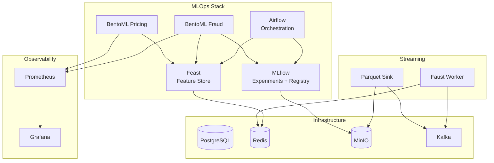
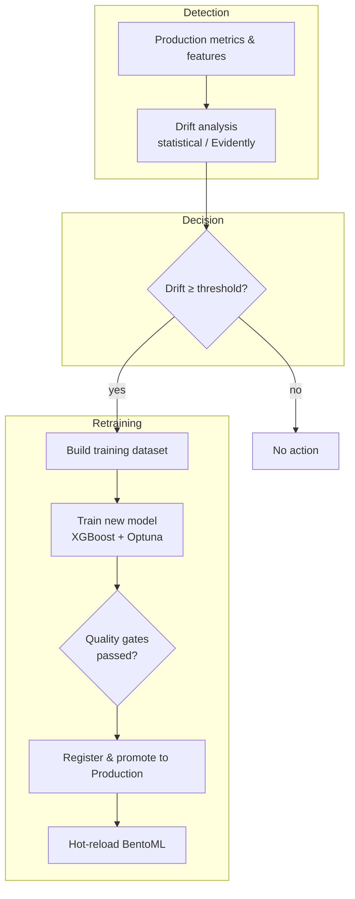

## Building a Production Fraud Detection Platform with Modern MLOps

Fraud detection systems age badly.

What works on day one quietly decays as fraud patterns evolve, user behavior shifts, and your product team keeps shipping new features. If you're unlucky, you only notice when chargebacks spike or regulators start asking awkward questions.

In this post I'll walk through how we built an end-to-end MLOps platform for fraud detection — from feature store and training to serving and monitoring. The system is designed to be:

- **Reproducible**: same pipeline runs locally and in production  
- **Observable**: clear signals when models are drifting or degrading  
- **Operable**: scheduled retraining and hot-reload keep models fresh  

The examples are framed around a ticketing platform (think large events, flash sales, and fraud attacks), but the same patterns apply to many real-time ML use cases.

---

## 1. Problem: Real-Time Fraud Under Constant Change

The core business problem looks like this:

- **Fraud detection**: Decide in real time whether a transaction is likely fraudulent, with low latency and high recall.

Two constraints make this interesting:

- **Live traffic** can spike (flash sales, mega-events) and includes evolving fraud patterns.
- **Models must remain fresh** without humans babysitting them every day.

We wanted an architecture where:

- Features and labels are managed systematically (no "mystery CSV" pipelines).
- Training and serving use the **same feature definitions**.
- Monitoring and retraining are **first-class citizens**, not afterthoughts.

---

## 2. High-Level Architecture

At a high level, the platform looks like this:

- **Infrastructure**: PostgreSQL, Redis, MinIO, Kafka (with Zookeeper)  
- **MLOps stack**: Feast (feature store), MLflow (experiments and registry), Airflow (orchestration), BentoML (model serving — fraud and dynamic pricing)  
- **Streaming**: A Faust worker consumes transactions from Kafka, maintains per-user aggregates, and writes real-time features to the Feast online store; a Parquet sink archives raw events from Kafka to MinIO for batch processing.  
- **Observability**: Prometheus and Grafana  
- **Notebooks**: Jupyter for exploratory model training and feature work  

**Data flow (simplified):**

1. **Streaming path**: The simulator (or live traffic) can produce transactions to Kafka. The Faust worker consumes them, maintains per-user aggregates (transaction count, amount, distinct events), and writes to the Feast online store under the `user_realtime_fraud_features` view. A Parquet sink batches the same events and writes them to MinIO in the `raw-events` bucket for historical use.
2. **Batch feature engineering**: An Airflow DAG (`feature_engineering_pipeline`) runs hourly: it reads raw Parquet from MinIO, computes the same user-level aggregates as the Faust worker, and materializes them into Feast so that both offline (training) and online stores stay in sync.
3. **Model training**: A weekly DAG (`model_training_pipeline`) builds a training dataset (synthetic in the current setup; in a full deployment this would use Feast historical retrieval), trains an XGBoost fraud model with Optuna, logs runs to MLflow, and can promote a new model and trigger a hot-reload of the fraud BentoML service.
4. **Serving**: Two BentoML services run in production: a **fraud detection** service that loads the latest Production model from MLflow and fetches online features from Feast to score transactions, and a **dynamic pricing** service that uses event-level features from Feast and a bandit-style policy to recommend prices.
5. **Monitoring and drift**: A daily DAG (`ml_monitoring_pipeline`) collects production-style metrics (synthetic in the current setup), computes a simple drift score (e.g. calibration gap between mean prediction and mean label), and applies a threshold (e.g. 0.3). When drift exceeds the threshold, the pipeline has stubs to send alerts and to trigger retraining; the codebase also includes shared utilities that support Evidently-based drift reports for richer analysis when needed.

Everything can run locally via Docker Compose, and the same topology scales out to Kubernetes in production.

---

## 3. Feature Store: Making Features a First-Class Asset

Instead of bespoke SQL scattered across notebooks and services, we centralize features in **Feast**.

### Entities and Feature Views

We model our domain with entities:

- **`user`**: `user_id`  
- **`event`**: `event_id`  
- **`promoter`**: `promoter_id`  

On top of these we define feature views:

- **`event_realtime_metrics`** (event): `current_inventory`, `sell_through_rate_5min`, `concurrent_viewers` (TTL: 60 minutes).  
- **`event_historical_metrics`** (event, promoter): `total_tickets_sold`, `avg_ticket_price`, `promoter_success_rate` (TTL: 365 days).  
- **`user_purchase_behavior`** (user): `lifetime_purchases`, `fraud_risk_score`, `preferred_category` (TTL: 365 days).  
- **`user_realtime_fraud_features`** (user): `user_txn_count_1h`, `user_txn_amount_1h`, `user_distinct_events_1h`, `user_avg_amount_24h` (TTL: 2 hours). This view is populated in real time by the Faust worker from Kafka and in batch by the feature-engineering DAG from MinIO Parquet.

Feast gives us:

- **Offline store** (DuckDB locally, BigQuery in production when configured) for training datasets; batch data sources are Parquet files locally or BigQuery tables in production.  
- **Online store** (Redis) for low-latency serving.  

Training uses **point-in-time-correct** historical retrieval when wired to Feast; serving uses **online feature lookup** with the same definitions. The fraud service and the dynamic pricing service both pull from the online store so that predictions use consistent, up-to-date features.

---

## 4. Training Pipeline: XGBoost + Optuna + MLflow

For fraud we use a **binary classifier** built with XGBoost:

- **Objective**: `binary:logistic`  
- **Label**: `is_fraud_label`  
- **Features**: e.g. `lifetime_purchases`, `fraud_risk_score`, and other behavior features from Feast (and in the streaming path, `user_realtime_fraud_features`).  

The training loop (as implemented in shared utilities and the Airflow DAG):

1. Build a training dataframe (from synthetic user metrics in the current DAG; in a full deployment, from Feast offline historical retrieval).  
2. Split into train/validation with stratification on the label.  
3. Run a small **Optuna** search over hyperparameters such as `max_depth`, `learning_rate`, `n_estimators`, `subsample`, `colsample_bytree`.  
4. For each trial: fit on the training set, evaluate ROC-AUC (and other metrics) on the validation set, and log params, metrics, and artifacts to **MLflow**.  
5. Train a final model with the best parameters and log the model to MLflow's artifact store (MinIO/S3 locally).  

MLflow acts as the single source of truth for experiment runs, metrics, model lineage, and the **model registry** (including which version is "Production"). The model training DAG can then call the fraud BentoML service’s `/admin/reload` endpoint so that the serving process hot-reloads the new model without restart.

---

## 5. Real-Time Serving with BentoML

We run two BentoML services in front of traffic.

### 5.1 Fraud Detection Service

The fraud API accepts a batch of transactions and returns fraud scores:

1. Receive a batch via HTTP (`/predict`).  
2. For each request, build entity rows (e.g. `user_id`, `event_id`).  
3. Fetch the latest online features from Feast (including `user_realtime_fraud_features` when available).  
4. Run `predict_proba` with the loaded XGBoost model and apply a threshold (e.g. 0.5).  
5. Return both `fraud_score` and a boolean `is_fraud`.  

The service resolves the **latest Production model** from MLflow’s registry, loads the artifact and metadata (feature names, threshold), and supports an admin endpoint to hot-reload after a new model is promoted.

### 5.2 Dynamic Pricing Service

The dynamic pricing service uses event-level features from Feast (e.g. `event_realtime_metrics`) and a bandit-style policy (e.g. Thompson sampling) to recommend pricing actions. It does not depend on MLflow; it reads only from the Feast online store and applies rule-based or learned policies to suggest price adjustments for events.

---

## 6. Monitoring and Drift Detection

A model that never changes is as risky as no model at all.

We use a **batch monitoring pipeline** to decide when to alert and when to retrain or hot-reload.

### 6.1 Drift Detection in the Daily DAG

The Airflow DAG `ml_monitoring_pipeline` runs daily and:

1. Collects production-style metrics (synthetic in the current implementation: sample predictions and labels).  
2. Computes a **drift score** from these metrics (e.g. absolute difference between mean prediction and mean label as a calibration/drift proxy).  
3. Compares the score to a configurable threshold (e.g. 0.3).  
4. If drift is above the threshold, the pipeline runs stubs that would send alerts (e.g. Slack/PagerDuty) and trigger the model training DAG in a full deployment.  

The codebase also includes shared monitoring utilities that can run Evidently-based drift and classification reports when Evidently is installed; the simulator’s drift validator can use the same. The daily DAG is kept simple and deterministic so it runs reliably in local and CI environments; richer Evidently reports can be wired in or run separately as needed.

---

## 7. Simulator: Stress-Testing the Whole Loop

To make sure the platform behaves under realistic and adversarial conditions, we built a **traffic simulator**.

It can generate:

- Events (sports, concerts, cultural, etc.) with power-law popularity.  
- Users with personas (casual, enthusiast, VIP, scalper, fraudster).  
- Transactions with rich context: ticket counts, tiers, payment methods, device info, fraud indicators.  

On top of these primitives we define **scenarios**:

- `normal-traffic`: baseline operations with modest fraud rates.  
- `flash-sale`: sudden spikes in request rate.  
- `fraud-attack`: coordinated credential stuffing, card testing, bot scalping.  
- `drift`: configurable drift level (0–1); seed-compatible data.  
- `system-degradation`: partial outages and slow dependencies.  
- `black-friday`: extreme loads across the stack.  
- `mix`: weighted combination of scenarios.  

In **realtime mode**, the simulator streams transactions at a configurable rate to Kafka (`raw.transactions`) as well as to the fraud API, so the Faust worker and Parquet sink run against live-like traffic.

Each scenario:

1. Sets up state (events, users, environment).  
2. Drives traffic against the APIs or synthetic stubs.  
3. Validates metrics (latency, error rates, drift, business KPIs) within tolerances and produces an HTML report.  

---

## 8. Configuration and Portability

All components are wired with a **Pydantic-based configuration system**:

- Environment variables such as `ENVIRONMENT=local` vs `production` switch between local storage (DuckDB, MinIO, local paths) and cloud resources (BigQuery, GCS, etc.).  
- Configuration classes encapsulate connection details for Postgres, Redis, MinIO, Kafka, Feast, and MLflow.  

The same codebase can run in a laptop lab with Docker Compose and scale to Kubernetes with more robust infrastructure without rewriting core logic.

---

## 9. Lessons Learned

A few practical takeaways from building this:

- **Treat features as products.** A feature store isn’t just "nice to have" — it’s how you avoid training/serving skew and "where did this CSV come from?" moments. Unifying streaming (Faust) and batch (Airflow) paths into the same feature views keeps serving and training aligned.  
- **Separate concerns.** Let Airflow orchestrate, MLflow track, BentoML serve, and each infra component do what it’s good at. Having two BentoML services (fraud and pricing) lets each evolve and scale independently.  
- **Close the loop.** Monitoring without retraining is passive; retraining without monitoring is blind. A simple daily drift score plus threshold, with stubs for alerts and retrain triggers, keeps the loop visible; you can add Evidently or other tools where needed.  
- **Simulate ruthlessly.** A good simulator with multiple scenarios and realtime Kafka mode surfaces failure modes and edge cases long before real users do, especially for fraud where adversaries adapt quickly.  

---

## 10. Where to Go from Here

If you’re running any real-time ML in production — fraud detection, recommendations, anomaly detection — you can adapt this architecture to your domain:

- Swap in your own **entities and feature views** in Feast.  
- Replace or extend the **fraud model** with your model of choice (classification, ranking, regression).  
- Add more **streaming consumers** (e.g. more Faust agents or Kafka sinks) and keep feature views in sync with batch materialization.  
- Define **failure signals** and thresholds that make sense for your business (chargebacks, SLA violations, revenue metrics).  
- Start simple: one or two DAGs, a single service, and a few dashboards; then add streaming, a second service, and drift monitoring.  

The end goal is a platform where your models don’t just ship once — they **stay fresh** through monitoring, scheduled retraining, and hot-reload as the world changes.

If you’re interested, I’m happy to share more details on any part of this stack (Feast design, streaming pipeline, Airflow DAGs, drift detection, or the simulator).
