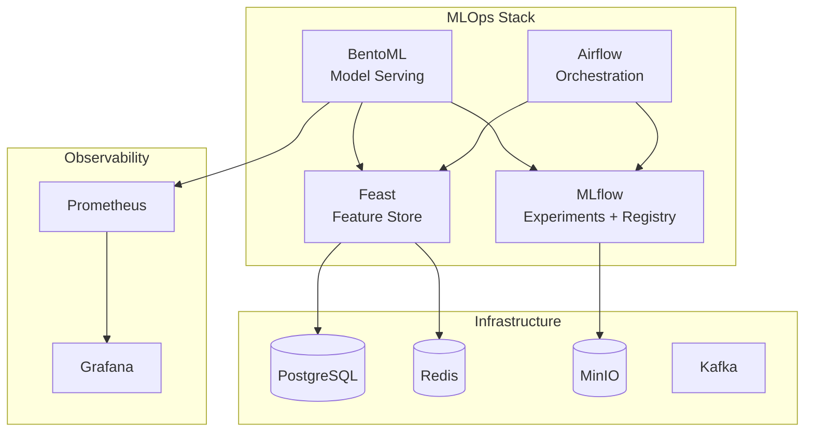
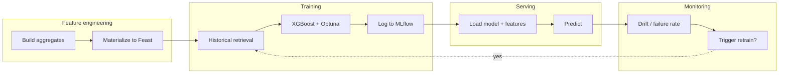
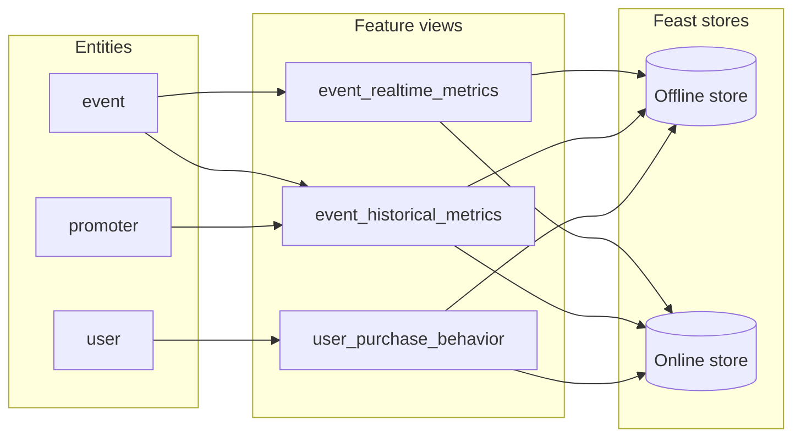
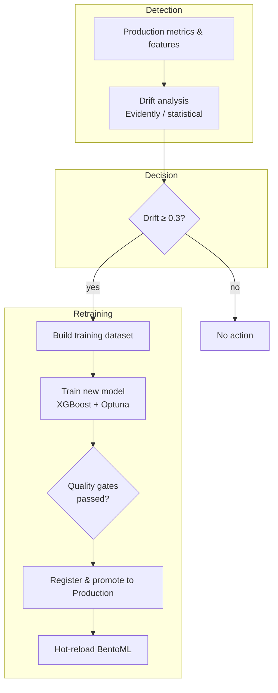

## Building a Production Fraud Detection Platform with Modern MLOps

Fraud detection systems age badly.

What works on day one quietly decays as fraud patterns evolve, user behavior shifts, and your product team keeps shipping new features. If you’re unlucky, you only notice when chargebacks spike or regulators start asking awkward questions.

In this post I’ll walk through how we built an end‑to‑end MLOps platform for fraud detection — from feature store and training to serving and monitoring. The system is designed to be:

- **Reproducible**: same pipeline runs locally and in production  
- **Observable**: clear signals when models are drifting or degrading  
- **Operable**: scheduled retraining and hot‑reload keep models fresh  

The examples are framed around a ticketing platform (think large events, flash sales, and fraud attacks), but the same patterns apply to many real‑time ML use cases.

---

## 1. Problem: Real‑Time Fraud Under Constant Change

The core business problem looks like this:

- **Fraud detection**: Decide in real time whether a transaction is likely fraudulent, with low latency and high recall.

Two constraints make this interesting:

- **Live traffic** can spike (flash sales, mega‑events) and includes evolving fraud patterns.
- **Models must remain fresh** without humans babysitting them every day.

We wanted an architecture where:

- Features and labels are managed systematically (no “mystery CSV” pipelines).
- Training and serving use the **same feature definitions**.
- Monitoring and retraining are **first‑class citizens**, not afterthoughts.

---

## 2. High‑Level Architecture

At a high level, the platform looks like this:

- **Infrastructure**: PostgreSQL, Redis, MinIO, Kafka/Zookeeper  
- **MLOps stack**: Feast (feature store), MLflow (experiments + registry), Airflow (orchestration), BentoML (model serving)  
- **Observability**: Prometheus + Grafana  

**Data flow (simplified):**

1. **Feature engineering** jobs build aggregates and materialize them into Feast (offline + online stores).
2. **Model training** jobs pull historical features from Feast, train models with XGBoost + Optuna, and log runs to MLflow.
3. **Serving** services (BentoML) load the latest model from MLflow and online features from Feast to respond to prediction requests.
4. **Monitoring & drift detection** track production behavior and can trigger retraining and hot‑reloads when drift is detected.

Everything can run locally via Docker Compose, and the same topology scales out to Kubernetes in production.

---

## 3. Feature Store: Making Features a First‑Class Asset

Instead of bespoke SQL scattered across notebooks and services, we centralize features in **Feast**.

### Entities and Feature Views

We model our domain with entities such as:

- **`user`**: `user_id`  
- **`event`**: `event_id`  
- **`promoter`**: `promoter_id`  

On top of these, we define feature views, e.g.:

Feature view examples:

- **`event_realtime_metrics`**:  
  - `current_inventory`, `sell_through_rate_5min`, `concurrent_viewers` (TTL: 60 minutes)  
- **`event_historical_metrics`**:  
  - `total_tickets_sold`, `avg_ticket_price`, `promoter_success_rate` (TTL: 365 days)  
- **`user_purchase_behavior`**:  
  - `lifetime_purchases`, `fraud_risk_score`, `preferred_category` (TTL: 365 days)

Feast gives us:

- **Offline store** (DuckDB locally, BigQuery in prod) for training datasets.
- **Online store** (Redis) for low‑latency serving.

Training uses **point‑in‑time‑correct** historical retrieval to avoid label leakage; serving uses **online feature lookup** with the same definitions.

---

## 4. Training Pipeline: XGBoost + Optuna + MLflow

For fraud, we use a **binary classifier** built with XGBoost:

- **Objective**: `binary:logistic`  
- **Label**: `is_fraud_label`  
- **Features**: e.g. `lifetime_purchases`, `fraud_risk_score`, and other behavior features from Feast.

The training loop:

1. Build a training dataframe from the offline store (Feast historical retrieval).
2. Split into train/validation with stratification on the label.
3. Run a small **Optuna** search over hyperparameters like `max_depth`, `learning_rate`, `n_estimators`, `subsample`, `colsample_bytree`.
4. For each trial:
   - Fit the model on the training set.
   - Evaluate ROC‑AUC (and other metrics) on the validation set.
   - Log params, metrics, and artifacts to **MLflow**.
5. Train a final model with the best parameters, compute SHAP values, and log the model to MLflow’s artifact store (backed by MinIO/S3).

MLflow acts as the **single source of truth** for:

- Experiment runs and metrics  
- Model lineage (which data and parameters created which model)  
- The **model registry**, including which version is “Production”

Airflow wraps this in a scheduled DAG (`model_training_pipeline`) that can run weekly or on demand.

---

## 5. Real‑Time Serving with BentoML

To put the model in front of real traffic, we use **BentoML** services.

### 5.1 Fraud Detection Service

The fraud API accepts a batch of transactions and returns fraud scores:

1. Receive a batch via HTTP (`/predict`).  
2. For each request, build **entity rows** (e.g. `user_id`, `event_id`).  
3. Fetch the latest online features from Feast.  
4. Run `predict_proba` with XGBoost and threshold at 0.5.  
5. Return both `fraud_score` and a boolean `is_fraud`.

The service knows how to:

- Resolve the **latest Production model** from MLflow’s registry.
- Load the XGBoost artifact and associated metadata (feature names, thresholds).

---

## 6. Monitoring and Drift Detection

A model that never changes is as risky as no model at all.

We use **batch drift analysis** to decide when to retrain and hot‑reload.

### 6.1 Drift Detection

An Airflow DAG (`ml_monitoring_pipeline`) runs daily to:

1. Collect production metrics and feature snapshots.
2. Compare distributions of numeric features vs a reference window using Evidently AI (or a statistical fallback).
3. Compute a **drift score** between 0 and 1.
4. If drift ≥ 0.3, mark it as significant and (in a full deployment) trigger alerts and/or retraining.

The fallback implementation is simple but robust: measure how far current means move away from reference, normalized by reference standard deviation, and average across columns. When drift is significant, the pipeline can trigger alerts and (in a full deployment) downstream retraining and hot‑reload via the model training DAG.

---

## 7. Simulator: Stress‑Testing the Whole Loop

To make sure the platform behaves under realistic and adversarial conditions, we built a **traffic simulator**.

It can generate:

- Events (sports, concerts, cultural, etc.) with power‑law popularity.  
- Users with personas (casual, enthusiast, VIP, scalper, fraudster).  
- Transactions with rich context: ticket counts, tiers, payment methods, device info, fraud indicators.

On top of these primitives, we define **scenarios**:

- `normal-traffic`: baseline operations with modest fraud rates.  
- `flash-sale`: sudden spikes in request rate.  
- `fraud-attack`: coordinated credential stuffing, card testing, bot scalping.  
- `gradual-drift`: seasonal behavior changes.  
- `system-degradation`: partial outages and slow dependencies.  
- `black-friday`: extreme loads across the stack.

Each scenario:

1. Sets up state (events, users, environment).  
2. Drives traffic against the APIs or synthetic stubs.  
3. Validates metrics (latency, error rates, drift, business KPIs) within tolerances.

---

## 8. Configuration and Portability

All these components are wired together with a **Pydantic‑based configuration system**:

- Environment variables like `ENVIRONMENT=local` vs `production` flip between local storage (DuckDB, MinIO, local paths) and cloud resources (BigQuery, GCS, etc.).
- Configuration classes encapsulate connection details for Postgres, Redis, MinIO, Feast, and MLflow.

This means the same codebase can:

- Run in a laptop lab with Docker Compose.
- Move to Kubernetes with more robust infra, without rewriting core logic.

---

## 9. Lessons Learned

A few practical takeaways from building this:

- **Treat features as products.** A feature store isn’t just “nice to have” — it’s how you avoid subtle training/serving skew and “where did this CSV come from?” moments.
- **Separate concerns.** Let Airflow orchestrate, MLflow track, BentoML serve, and your infra components do what they’re good at. Monoliths are tempting but hard to reason about.
- **Close the loop.** Monitoring without retraining is passive; retraining without monitoring is blind. Drift detection plus scheduled (or triggered) retraining keeps models aligned with production.
- **Simulate ruthlessly.** A good simulator surfaces failure modes and edge cases long before real users do, especially for fraud where adversaries adapt quickly.

---

## 10. Where to Go from Here

If you’re running any real‑time ML in production — fraud detection, recommendations, anomaly detection — you can adapt this architecture to your domain:

- Swap in your own **entities and feature views** in Feast.  
- Replace the **fraud model** with your model of choice (classification, ranking, regression).  
- Define **failure signals** and thresholds that make sense for your business (chargebacks, SLA violations, revenue metrics).  
- Start simple: one or two DAGs, a single service, and a few dashboards. Then iterate.

The end goal is a platform where your models don’t just ship once — they **stay fresh** through monitoring, scheduled retraining, and hot‑reload as the world changes.

If you’re interested, I’m happy to share more details on any part of this stack (Feast design, Airflow DAGs, drift detection, or the simulator).

